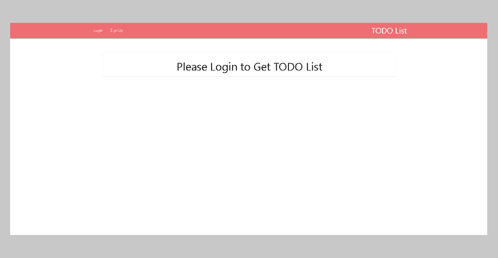
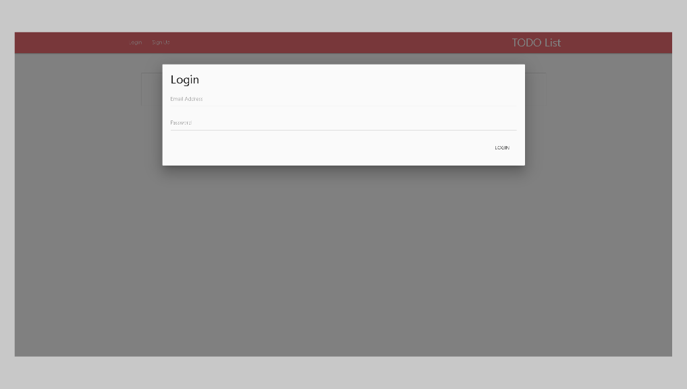
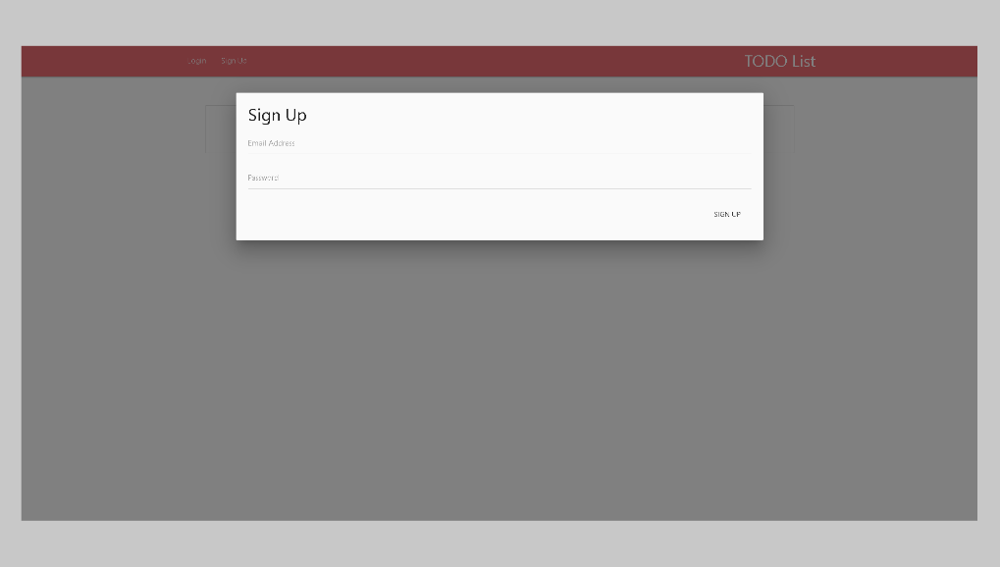
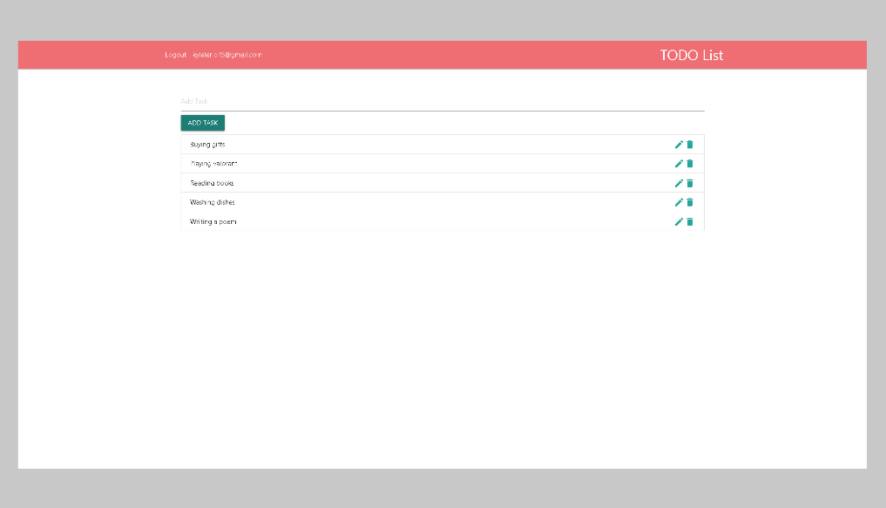

# TODO List JavaScript with Firebase Firestore and Authentication Project

## Login Design

## Sign up Design

## Todo List Design

**This is a JavaScript Beginner TODO list that has a simple UI design with firebase firestore for real time changes of document, rending the list, and  save, remove, and update the task. You can also signin, signup and logout buttons using the firebase authentication.**

This is my first Todolist project in my web development journey, I hope you will like it.